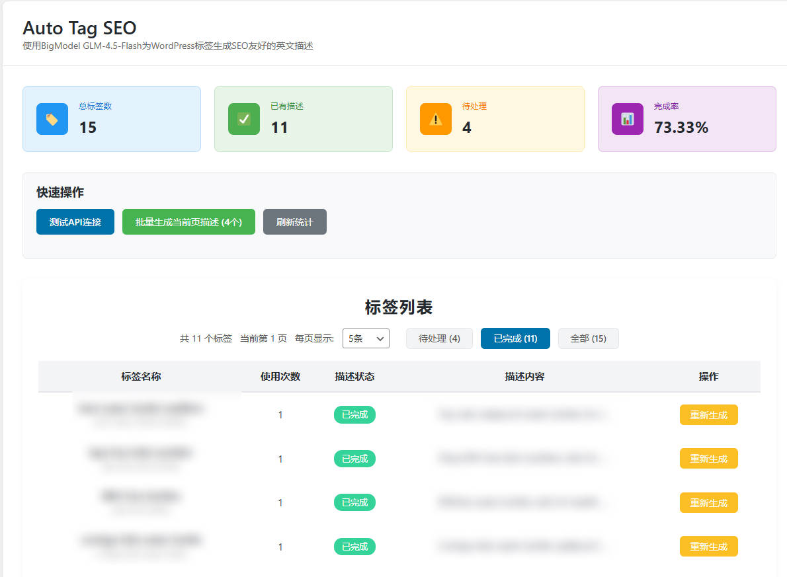

# 
# Auto Tag SEO

为 WordPress 自动生成标签 SEO 英文描述，提升站点 SEO 效果。

## 功能简介
- 自动为 WordPress 标签生成简洁、SEO 友好的英文描述
- 支持批量和单个标签描述生成（后台分批执行，默认以当前页数量为总量，每批5个，间隔10秒）
- 后台可视化管理与参数配置
- 统计标签描述完成率
- 支持自定义 API Key、模型参数
- 现代化 UI，极简美观

## 安装方法
1. 上传插件文件夹到 `/wp-content/plugins/auto-tag-seo/`
2. 在 WordPress 后台启用“Auto Tag SEO”插件
3. 进入“设置 > Auto Tag SEO”页面，前往 [BigModel 控制台](https://open.bigmodel.cn/usercenter/apikeys) 获取 API Key 并填写
4. 配置模型参数（可选），保存设置

## 使用说明
- 在设置页面可查看标签统计、筛选、分页、批量/单个生成描述
- 支持一键批量生成当前页所有标签描述（任务将后台分批执行，避免页面阻塞；稍等片刻后刷新查看最新状态）
- 支持单个标签描述生成与重新生成
- 支持自定义 API Key 及模型参数

## 主要参数说明
- **API Key**：需在 BigModel 控制台获取并填写
- **API Endpoint**：默认无需修改
- **Model**：如 `glm-4.5-flash`，可根据 BigModel 支持的模型调整
- **Max Tokens**、**Temperature**、**Top P**、**Frequency Penalty**：控制生成内容长度与风格
- **System Prompt**：AI 生成描述的提示词，可自定义

## 安全提示
- 请勿泄露您的 API Key
- 本插件不会上传您的数据，仅与 BigModel API 通信

## 常见问题
- **API Key 无效/未填写**：请确保已在 BigModel 控制台获取并填写正确的 Key
- **描述生成失败**：请检查 API Key、网络连接及模型参数设置

## 开源协议

## 更新日志

### 1.2.0
- 新增：批量任务后台异步分批执行（WP Cron），默认以当前页数量为总量，每批处理5个，批次间隔10秒，避免后台页面AJAX阻塞
- 优化：后台脚本模块化（assets/admin.js），修正脚本本地化绑定
- 优化：标签描述更新改用 `wp_update_term`，失败兜底清理缓存，确保数据一致性
- 优化：设置保存增加字段级 sanitize/validate，提升安全与稳定性
- 优化：激活时不覆盖用户已有配置，仅在首次安装时写入默认配置
- 优化：轻量修复与整理后台样式（assets/admin.css）

### 1.0.0
- 首次发布

GPL v2 or later

---

如有建议或问题，欢迎访问 [GitHub 项目主页](https://github.com/b6421582/Auto-Tag-SEO) 反馈。

---

作者主页：[https://catchideas.com/](https://catchideas.com/)
